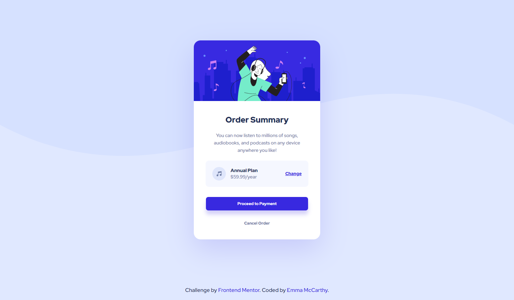

# Frontend Mentor - Order Summary Card Solution

This is a solution to the [Order summary card challenge on Frontend Mentor](https://www.frontendmentor.io/challenges/order-summary-component-QlPmajDUj). Frontend Mentor challenges help you improve your coding skills by building realistic projects. 

## Table of contents

- [Overview](#overview)
  - [The challenge](#the-challenge)
  - [Screenshot](#screenshot)
- [My process](#my-process)
  - [Built with](#built-with)
  - [What I learned](#what-i-learned)
  - [Continued development](#continued-development)
  - [Useful resources](#useful-resources)
- [Author](#author)
- [Acknowledgments](#acknowledgments)

## Overview

### The challenge

Users should be able to:

- See hover states for interactive elements

### Screenshot

### Built with

- Semantic HTML5 markup
- CSS custom properties
- Flexbox

### What I learned

I am still new to HTML and CSS so I used this project to practise what I have learned about Semantic HTML, Flexbox and Grid. I have recieved some really useful feedback on my first two Frontend Mentor projects and I tried my best to implement some of those improvements in this design - for example, in this project I used aria-hidden="true" and null alt attribites to enable screen readers to skip over decorative images. I also used grid emplate areas for the first time and started working with REMS and EMS.

#### What am I most proud of?

- Getting flexbox to do what I wanted it to do!
- I think my HTML mark up is improving!?!

### Continued development

I struggled with the background image in the body - I am not sure I like how it moves when the viewpoint size changes, so I need to develop my understanding of this area a little more.

### Useful resources

- [CSS EM and REM explained](https://www.youtube.com/watch?v=_-aDOAMmDHI&t=279s) - This helped me really started to understand these two units and how/when to use them.
- [Semantic HTML Cheat Sheet](https://learn-the-web.algonquindesign.ca/topics/html-semantics-cheat-sheet/) - I used this to refer to when marking up my page.
- [Accessibility: Image Alt text best practices](https://help.siteimprove.com/support/solutions/articles/80000863904-accessibility-image-alt-text-best-practices) - I used this article to help develop my understanding of Alt attributions.

## Author

- Frontend Mentor - [@MissEmMcCarthy](https://www.frontendmentor.io/profile/MissEmMcCarthy)
- Twitter - [@MissEmMcCarthy](https://twitter.com/MissEmMcCarthy)

## Acknowledgments

Huge thank you to [PhoenixDev22] (https://www.frontendmentor.io/profile/PhoenixDev22) and [NaveenGumaste] (https://www.frontendmentor.io/profile/Crazimonk) for their super useful feedback on my last two projects.

